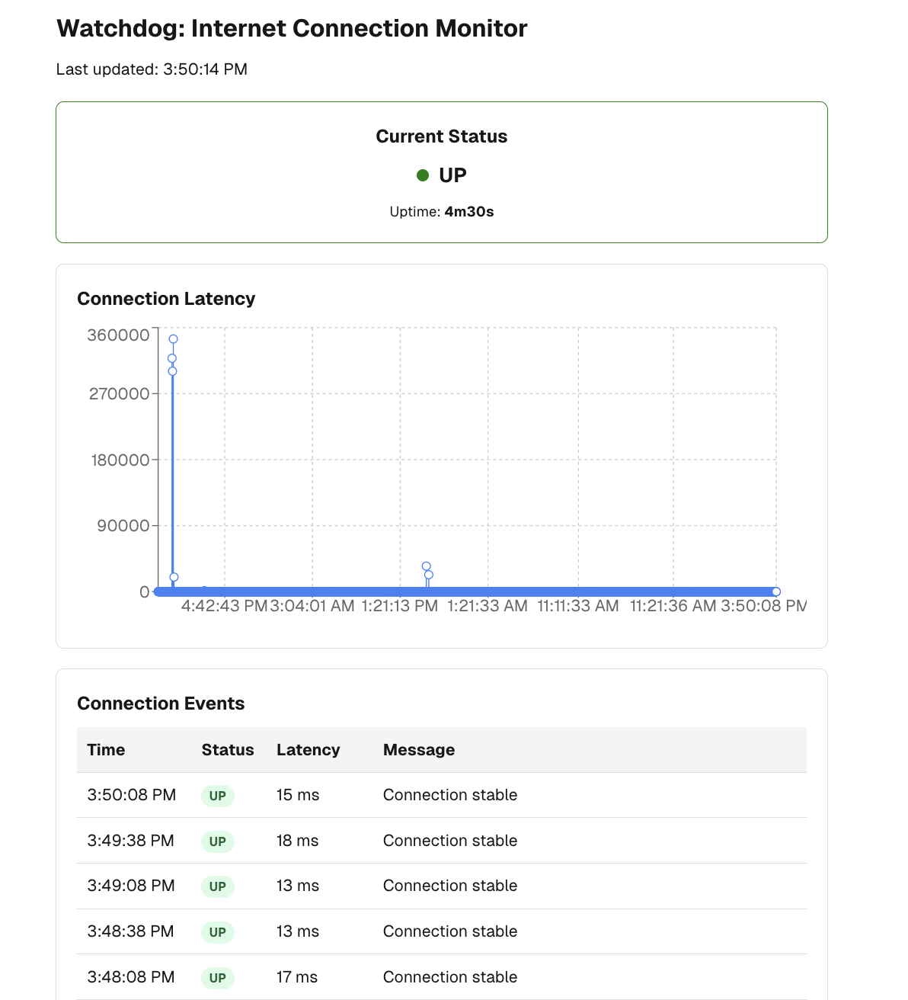

# WatchDog

A lightweight, cross-platform tool for monitoring your internet connection stability and visualizing connection drops.
<p align="center">
   
</p>

## Features

- **Real-time monitoring** of internet connectivity using ping
- **Cross-platform support** (Windows, macOS, Linux)
- **Detailed logging** with timestamps of all connection changes
- **Uptime/downtime tracking** with duration of connection issues
- **Interactive dashboard** for visualizing connection quality
- **CSV export** for further analysis in spreadsheet software

## Project Structure

```
watchdog/
├── cmd/            # Command-line applications
│   └── watchdog/   # Main application entry point
├── internal/       # Private application code
│   ├── monitor/    # Connection monitoring logic
│   └── server/     # HTTP API server
├── app/            # Frontend Next.js application
└── scripts/        # Helper scripts
```

## Components

This project consists of two main components:

1. **Backend Monitor** (Go): Performs regular connection checks and logs results
2. **Frontend Dashboard** (Next.js): Visualizes the connection data in a user-friendly interface

## Installation

### Prerequisites

- [Go](https://golang.org/dl/) 1.18 or higher
- [Node.js](https://nodejs.org/) 18 or higher (for Next.js frontend)
- [Make](https://www.gnu.org/software/make/) (optional, for using the Makefile)

### Quick Setup

The project includes a Makefile to simplify building and running:

```sh
# Clone the repository
git clone https://github.com/malston/watchdog.git
cd watchdog

# Build both backend and frontend
make build

# Run backend
make run-backend

# In a separate terminal
make run-frontend
```

### Manual Setup

#### Backend

```sh
# Build the backend
go build -o watchdog ./cmd/watchdog

# Run the backend
./watchdog
```

#### Frontend

```sh
# Navigate to the app directory
cd app

# Install dependencies
npm install

# Start the development server
npm run dev
```

## Usage

### Running the Backend Monitor

Start the connection monitor with:

```sh
./watchdog
```

By default, it will:

- Ping Google DNS (8.8.8.8) every 30 seconds
- Save results to `connection_log.csv` in the current directory
- Show colored status indicators in the terminal
- Start an HTTP API server on port 8080

### Configuration

You can modify these settings:

```sh
❯ ./watchdog -h
Usage of ./watchdog:
  -api-port int
        Port for the HTTP API server (default 8080)
  -check-interval int
        Interval between checks in seconds (default 30)
  -log-file string
        Log file path (default "connection_log.csv")
  -ping-count int
        Number of ping packets to send (default 3)
  -ping-target string
        Target to ping (default "8.8.8.8")
  -ping-timeout int
        Ping timeout in seconds (default 5)
```

### Understanding the Log Output

The CSV log file contains the following columns:

- `timestamp`: Date and time of the check
- `status`: Connection status (UP/DOWN)
- `latency`: Ping response time in milliseconds (-1 for DOWN)
- `uptime`: Duration the connection has been up
- `downtime`: Duration the connection has been down
- `total_changes`: Number of status changes (UP to DOWN or DOWN to UP)
- `message`: Description of the status

### Using the Dashboard

Open a web browser and navigate to:

```sh
http://localhost:3000
```

The dashboard will automatically display:

- Current connection status
- Historical latency graph
- Connection uptime/downtime statistics
- Detailed event timeline

## Development

### Project Structure

- `cmd/watchdog/`: Main application entry point
- `internal/monitor/`: Connection monitoring logic
- `internal/server/`: HTTP API server
- `app/`: Next.js frontend application
- `scripts/`: Helper scripts

### Building and Testing

```sh
# Build both backend and frontend
make build

# Build only backend
make build-backend

# Build only frontend
make build-frontend

# Run tests
go test -v ./...
```

## Deployment

For continuous monitoring, you can:

### Backend

- Run the Go monitor as a service using systemd (Linux), launchd (macOS), or Windows Services
- Set up the monitor to start automatically on boot

### Frontend

- Build the Next.js app for production with `npm run build`
- Serve the static files using a lightweight server like Nginx or use a service like Vercel

## Troubleshooting

### Common Issues

1. **Permission denied for ping**
   - Run the application with sudo/administrator privileges
   - On Linux, use `setcap cap_net_raw=+ep ./watchdog`

2. **CSV file not updating**
   - Check write permissions for the directory
   - Use an absolute path for the log file

3. **Frontend not showing data**
   - Verify the backend is running and generating the CSV
   - Check the browser console for any errors
   - Ensure the API server is running on port 8080

## Contributing

Contributions are welcome! Please feel free to submit a Pull Request.

## License

This project is licensed under the MIT License - see the LICENSE file for details.

## Acknowledgements

- Thanks to all contributors
- Inspiration from various network monitoring tools